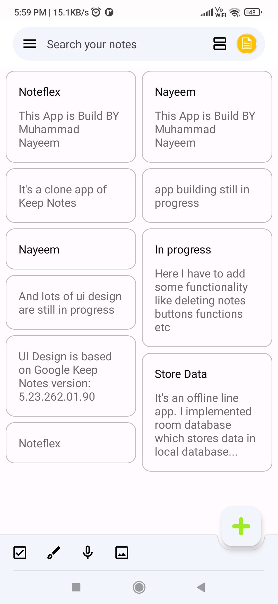
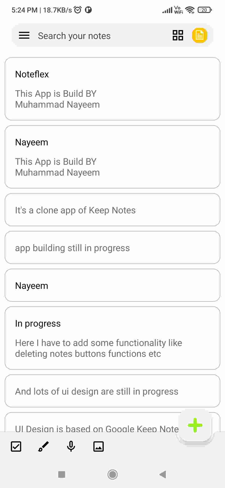
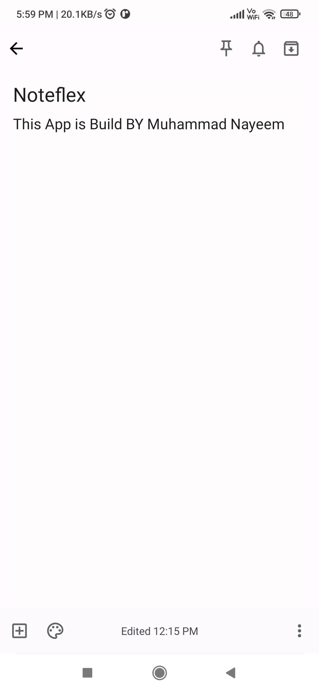

  
  <h1>Noteflex</h1>

Notes app for Android.

## About

Noteflex is a comprehensive note-taking app that enables you to effortlessly capture, organize, and
manage your ideas, thoughts, and information in a digital format. This feature-rich application
offers a diverse array of functionalities, such as text formatting, checklists, and seamless syncing
across multiple devices. Whether you're utilizing Noteflex for personal or professional purposes,
its versatility ensures that it caters to a wide range of needs and requirements.

## Screenshots

  
  
  

## Development Setup

Before you begin, you should have already downloaded the Android Studio SDK and set it up correctly.
You can find a guide on how to do this
here:[Setting up Android Studio](http://developer.android.com/sdk/installing/index.html?pkg=studio).

## Building the Code

1. Clone the repository using HTTP: git clone https://github.com/nayeemdv/Memely.git

2. Open Android Studio.

3. Click on 'Open an existing Android Studio project'

4. Browse to the directory where you cloned the **Memely** repo and click OK.

5. Let Android Studio import the project.

6. Build the application in your device by clicking run button.

## Contributing

Whether you have ideas, translations, design changes, code cleaning or really heavy code changes,
help is always welcome. The more is done, the better it gets! Please respect our Code of Conduct in
order to keep all interactions and discussions healthy.

<table><td>
<a href="#start-of-content">↥ Scroll to top</a>
</td></table>

